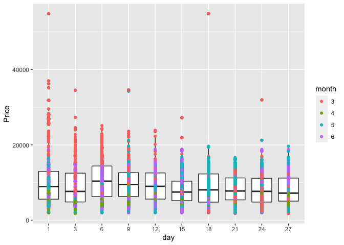

    library(tidyverse)

    ## ── Attaching packages ──────────────────────────────────────────────────────────────────────── tidyverse 1.3.0 ──

    ## ✓ ggplot2 3.3.0     ✓ purrr   0.3.3
    ## ✓ tibble  2.1.3     ✓ dplyr   0.8.5
    ## ✓ tidyr   1.0.2     ✓ stringr 1.4.0
    ## ✓ readr   1.3.1     ✓ forcats 0.5.0

    ## ── Conflicts ─────────────────────────────────────────────────────────────────────────── tidyverse_conflicts() ──
    ## x dplyr::filter() masks stats::filter()
    ## x dplyr::lag()    masks stats::lag()

    data = read.csv("Data_Train.csv")
    data = data %>% separate(col = "Date_of_Journey", c("day", "month", "year"), sep = "/")
    data$day = as.numeric(data$day)
    data$month = as.numeric(data$month)
    first = data %>% filter(day >= 1 & day <= 10) %>% mutate(period = "day1-10")
    second = data %>% filter(day >= 11 & day <= 20) %>% mutate(period = "day11-20")
    total <- rbind(first, second)
    third = data %>% filter(day >= 21 & day <= 31) %>% mutate(period = "day21-31")
    data <- rbind(total, third)
    data$period = as.factor(data$period)
    data$month = as.factor(data$month)
    data$day = as.factor(data$day)
    data = data %>% filter(Additional_Info != "Business class")
    data = data %>% filter(Airline != "Jet Airways Business")

    p <- ggplot(data, mapping = aes (x = day, y = Price))
    p + geom_boxplot() + geom_point(mapping = aes(color = month))

    newdata = data %>% filter(Price>70000)

For my project, I’m going to mainly study the data science of the
relationship between time and airfares. Specifically, time includes
multiple aspects- the day and month of the flight (Year will not be
studied because the data only includes airfares in 2019.), the departure
and arrival time, the duration of the flights, and the time that tickets
are ordered. My figure 1 shows the trend of how ticket price(Economy
class only) is related to the day and month of the flight. From my
figure, I notice that the ticket price is generally high in March(red
points), especailly for day1-15 (the first half of the month). And the
ticket price is also high in May(blue), especially for day 18-27(the
second half of the month). However, the ticket price is relatively low
in April as most of the green points are at the bottom. The price in
June (purple) is in the middle. What’s more, for the price of each day,
there is no significant difference between the average ticket price, but
there is a slight peak at around day 6,9 and 12. Thus, the key point is
that flight ticket prices are constantly changing from different days
and different months. While there is no obvious pattern, there is
evidence showing that tickets for flights at different times, either in
different days or months, would have different prices. Overall, from
this figure, the best strategy is to buy flight tickets in April.
